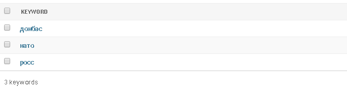
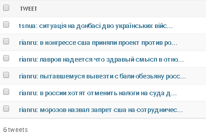

# Django Twitter monitor
Django + Scrapy project for monitoring tweets from specified Twitter accounts for specific keywords.

## Apps
* scraper: main app, implements necessary models and Scrapy spider.

## Tasks
Backend tasks powered by celery and django-celery-beat scheduler.

## Usage
Spider can be executed from celery-beat as periodic task or manually by command:
```
python manage.py crawl
```

# Lab3 - Моніторинг постів в соціальних мережах
Розроблена система моніторингу здійснює пошук ключових слів у текстах твітів вказаних Twitter-аккаунтів із деякою періодичністю, наприклад 60 хвилин.

Аккаунти, ключові слова та знайдені твіти являють собою моделі Django. Взаємодія з ними відбувається через адмін-панель Django.

Перед доданням ключового слова можна провести стемінг (виділення основи слова), підтримуються українська, російська та англійська мови.
Стемінг можна не проводити, якщо слово є абревіатурою, скороченням або власною назвою.

Реалізовано вхід в заданий Twitter-аккаунт та подальший пошук в текстах найновіших твітів доданих в бд аккаунтів за допомогою
так званого "павука" (scrapy.Spider).

При тестовому запуску здійснювався пошук по словах:



В текстах твітів наступних аккаунтів:


Знайдені твіти:



Кожен збережений твіт містить дату створення, аккаунт на якому він був знайдений та ключове слово:

